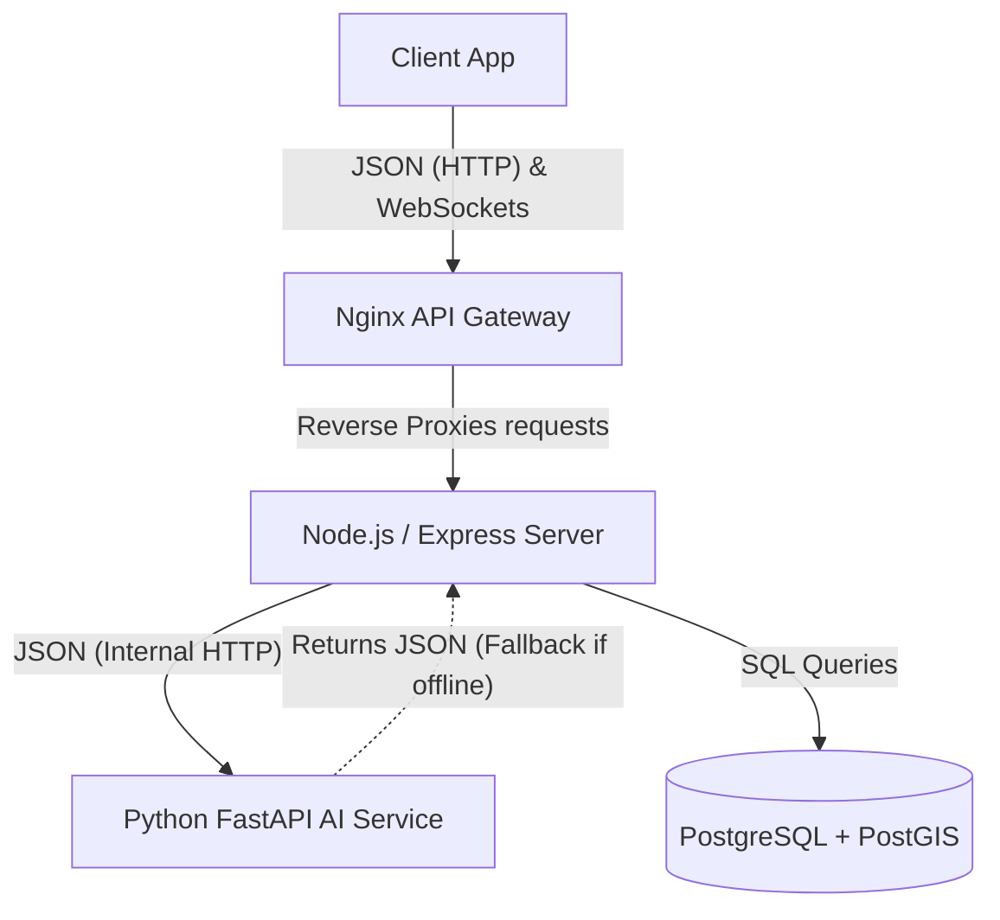
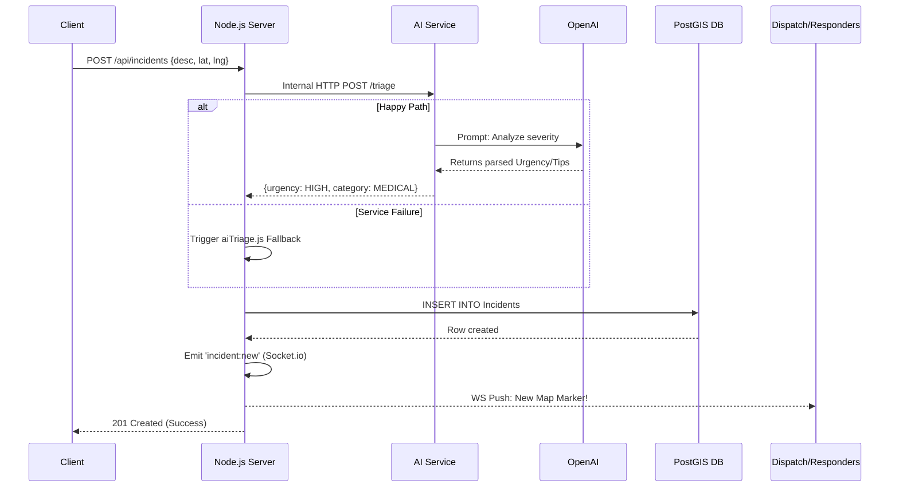
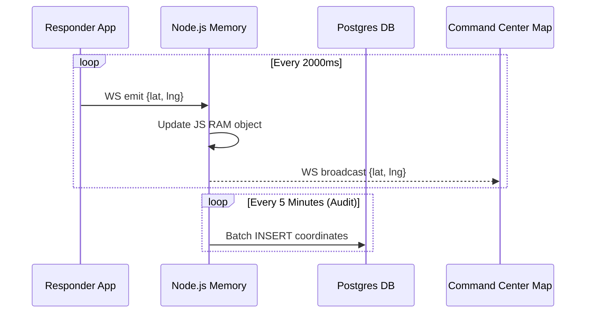
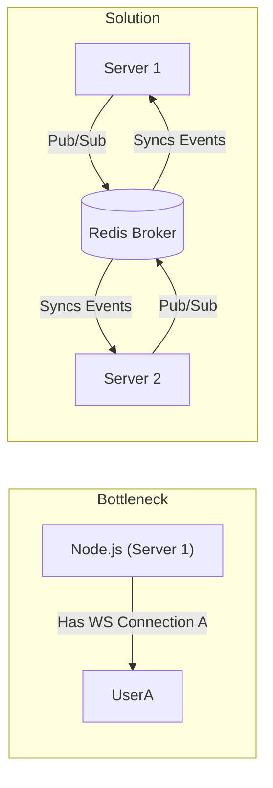

# SentinelGrid: Comprehensive Architectural Analysis & System Design

This document outlines the entire architectural flow, system design choices, and data pipelines of the **SentinelGrid** Disaster Relief project.

## 1. High-Level Architecture & Service Boundaries

### Component Breakdown & Design Thinking

#### 1. Client App (React + Vite + Zustand + React-Leaflet)
* **What it does:** The user interface for citizens reporting emergencies, responders tracking tasks, and command center admins viewing the global map.
* **Why this tool & not others?**
  * *React:* Chosen for component reusability and mature ecosystem. (Alternative: Angular/Vue).
  * *Zustand:* Used instead of *Redux* because it avoids heavy boilerplate, providing lightweight, localized global state—crucial for high-frequency updates like live map markers.
  * *Leaflet:* Extremely lightweight compared to Google Maps SDK. Since it's open-source, it avoids expensive API calls when rendering thousands of disaster points.
* **What exactly is passed on?** The client passes JSON payloads (e.g., `{ description, location: {lat, lng}, category }`) via HTTP POST and streams live GPS coordinates via WebSockets to the Nginx Gateway.

#### 2. Nginx API Gateway
* **What it does:** Acts as the entry point, routing external traffic. `/api` goes to the backend HTTP routes, `/socket.io` handles WebSocket upgrades.
* **Why this tool & not others?**
  * Chosen over *Apache* or Node.js direct exposure because Nginx is a highly efficient C-based asynchronous proxy that excels at handling high concurrency and terminating SSL/TLS headers safely.
* **What exactly is passed on?** It strips the external routing layers and forwards raw HTTP requests and TCP-level WebSocket streams directly to the internal network port of the Node.js server.

#### 3. Core API Server (Node.js + Express + Socket.io)
* **What it does:** The central nervous system. It orchestrates business logic, authenticates users, talks to the DB, and manages real-time broadcast rooms.
* **Why this tool & not others?**
  * *Node.js* was chosen over *Django* or *Spring Boot* because its non-blocking, event-driven V8 engine is historically the most performant and natural fit for maintaining thousands of concurrent long-lived WebSocket connections (Socket.io).
* **What exactly is passed on?** It takes the client JSON, transforms it, passes it internally to the AI service, awaits the response, executes SQL inserts via Sequelize to the Database, and emits binary/JSON websocket frames to connected clients.

#### 4. AI Triage Engine (Python + FastAPI)
* **What it does:** Processes raw incident descriptions to determine severity, categorization, and survival tips using GPT-4o.
* **Why this tool & not others?**
  * *Python/FastAPI* is the industry standard for AI integrations. We separated this from the Node.js monolith because AI text processing (even just managing large prompts/tokens) can be blocking. By making it a standalone microservice, the Node.js event loop remains completely free to process live GPS pings.
* **What exactly is passed on?** It receives raw incident text as JSON, passes it to OpenAI via API, parses the OpenAI response, and returns structured JSON (Urgency, Category, Tips) back to the Node server.

#### 5. Database (PostgreSQL + PostGIS)
* **What it does:** The permanent source of truth for all users, incidents, and assignments.
* **Why this tool & not others? (System Design Core Decision)**
  * Why not *MongoDB*? Because disaster coordination is a **Geospatial** domain. *PostgreSQL* combined with *PostGIS* provides industry-leading spatial indexing (R-trees) allowing incredibly fast queries like "Find all incidents within a 5km radius of a responder." Mongo's geospatial features are primitive compared to PostGIS.
* **What exactly is passed on?** It stores structured relational data and binary spatial coordinates, returning relational datasets to the ORM (Sequelize).

---

## 2. The Request Pipeline: Citizen SOS Flow

### Flow Breakdown & Data Hand-offs
1. **The Hand-off (Client to Node):** The user submits form data. The browser serializes this into a JSON payload and HTTP POSTs it to the server.
2. **The Hand-off (Node to AI):** The Node server extracts just the `{ description, photo_url }` and makes a blocking (but async) internal network request to the Python container.
3. **The Design Pattern (Resiliency):** If the AI service times out, the Node.js server catches the exception and executes a local `aiTriage.js` script. This **Circuit Breaker / Fallback** pattern ensures that critical SOS messages are never dropped just because a 3rd party API (OpenAI) is down.
4. **The Hand-off (Node to DB):** Node maps the final triage data onto a Sequelize model, converting standard lat/lng floats into a PostGIS `POINT()` geometry type.
5. **The Hand-off (Node to Responders):** Node.js loops through all active Websocket connections subscribed to the `role:COMMAND` room and pushes the newly formatted JSON incident object over the TCP socket. The Responder's React state (`Zustand`) instantly pushes it to the UI.

---

## 3. High-Frequency Real-Time Telemetry (Responder Tracking)

### System Design Constraints & Thinking
* **The Problem:** If 10,000 responders send their GPS coordinates every 2 seconds, that is 5,000 DB Writes Per Second (WPS). A standard PostgreSQL instance will suffer from extreme lock contention and crash under this load.
* **The Solution:** The Node.js server maintains an `in-memory` dictionary of active responder locations. When a ping arrives, it overwrites the RAM value and immediately broadcasts it to the Command Center via WebSockets. It **does not** touch the SQL database for every ping. 
* **Trade-offs:** We trade data durability (if the Node server crashes, we lose 2 seconds of tracking data) for extreme horizontal scalability. For historical auditing, we would batch-write to the DB lazily in the background.

---

## 4. Scaling Bottlenecks (Interview Prep)

If scaling to a national level:

* **The Problem:** Socket.io is **Stateful**. If User A connects to Node Server 1, and User B connects to Node Server 2, Server 1 cannot broadcast an SOS to User B because they don't share memory.
* **The Solution:** Introduce **Redis** with the `@socket.io/redis-adapter`. Redis acts as a high-speed message broker. When Server 1 receives an SOS, it publishes to Redis. Redis fans the event out to all Node servers instantly, ensuring all clients receive the WebSocket push regardless of which load-balanced server they are connected to.
